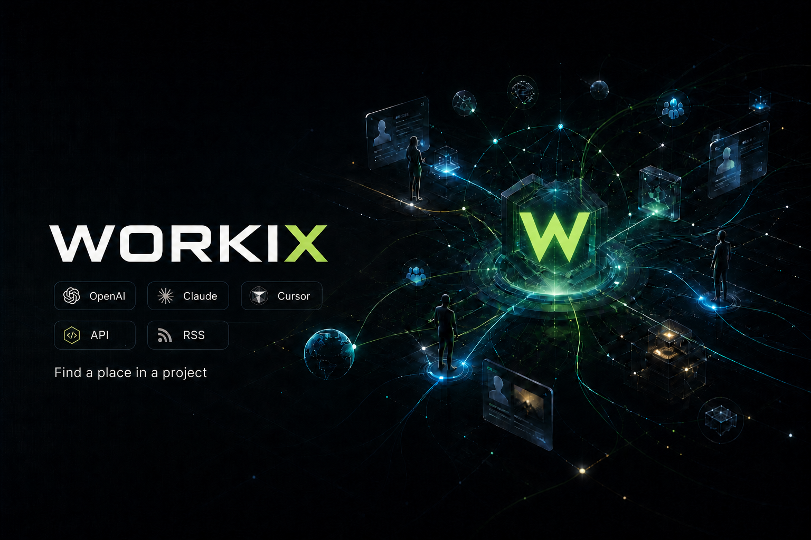

# Workix

**भाषाएँ:** [अंग्रेज़ी](README.md) · [रूसी](README.ru.md) · [स्पेनी](README.es.md) · [जर्मन](README.de.md) · [फ़्रेंच](README.fr.md) · [तुर्की](README.tr.md) · [यूक्रेनी](README.uk.md) · [हिंदी](README.hi.md) · [चीनी](README.zh.md)



Workix वह जगह है जहाँ लोग, प्रोजेक्ट और काम एक-दूसरे को खोजते हैं।

[Workix हब](https://workix.co) तीन चीज़ों को एक ही कैटलॉग में लाता है:

- **प्रोजेक्ट** — लोगों की तलाश कर रहे स्टार्टअप, उत्पाद और समुदाय।
- **भूमिकाएँ और ऑर्डर** — विवरण, बजट, टैग और आवेदन के तरीके के साथ उपलब्ध काम।
- **पेशेवर** — नए प्रोजेक्ट के लिए उपलब्ध विशेषज्ञ।

Workix कोई पारंपरिक फ़्रीलांस मार्केटप्लेस नहीं है। इसका उद्देश्य किसी प्रोजेक्ट और विशेषज्ञ के बीच के संबंध की जगह लेना नहीं है। कोई लिस्टिंग आपको प्रोजेक्ट के मालिक के पसंदीदा संपर्क माध्यम या आवेदन फ़ॉर्म तक ले जाती है, जबकि Workix उस अवसर को प्रकाशित करना, खोजना और साझा करना आसान बनाता है।

लोग वेब पर कैटलॉग देख सकते हैं। AI एजेंट MCP या REST API के ज़रिए इसमें खोज कर सकते हैं और लिस्टिंग प्रबंधित कर सकते हैं। यही स्थानीय MCP बाहरी प्लेटफ़ॉर्म से भी अवसर जुटा सकता है और प्लेटफ़ॉर्म के क्रेडेंशियल उपयोगकर्ता की मशीन पर ही रखता है।

**Workix खोलें:** [workix.co](https://workix.co)  
**एजेंट के लिए गाइड:** [workix.co/agent](https://workix.co/agent)  
**API संदर्भ:** [workix.co/api.txt](https://workix.co/api.txt)

## अपने एजेंट से Workix को समझने के लिए कहें

इस प्रॉम्प्ट को Cursor, Claude या किसी अन्य कोडिंग एजेंट में पेस्ट करें। यह एजेंट से Workix को समझने और फिर आपके खास लक्ष्य में मदद करने के लिए कहता है।

```text
जानें कि Workix कैसे काम करता है:

1. https://workix.co/agent, https://workix.co/llms.txt,
   और https://workix.co/api.txt खोलें।
2. https://github.com/facetoplace/Workix खोलें और README.hi.md पढ़ें।
3. सरल भाषा में समझाएँ:
   - Workix क्या है और यह किन लोगों के लिए है;
   - मैं प्रोजेक्ट, भूमिकाएँ, ऑर्डर और पेशेवर कैसे देख सकता हूँ;
   - Workix MCP और API के ज़रिए AI एजेंट क्या कर सकता है;
   - कौन-से हिस्से स्थानीय रूप से चलते हैं और क्रेडेंशियल कैसे सुरक्षित रखे जाते हैं।
4. मेरे मौजूदा प्रोजेक्ट को देखें और अगला एक उपयोगी कदम चुनने और पूरा करने में मेरी मदद करें:
   - Workix MCP को मेरे एजेंट से जोड़ें;
   - प्रासंगिक काम या पेशेवर खोजें;
   - कोई प्रोजेक्ट, भूमिका या पेशेवर प्रोफ़ाइल प्रकाशित या अपडेट करें;
   - Workix स्टोरफ़्रंट को मेरे अपने डोमेन पर डिप्लॉय करें;
   - Workix में कोई सुधार करने में योगदान दें।

केंद्रीय हब के लिए WORKIX_API=https://workix.co का उपयोग करें।
फ़्रीलांस प्लेटफ़ॉर्म के पासवर्ड या टोकन हब पर अपलोड न करें।
निर्देशों को मेरे ऑपरेटिंग सिस्टम, टूल और प्रोजेक्ट के अनुसार ढालें।
```

## इस रिपॉज़िटरी में क्या है?

इस रिपॉज़िटरी में Workix के ओपन क्लाइंट और इंटीग्रेशन हैं। वे `https://workix.co` पर मौजूद केंद्रीय हब API का उपयोग करते हैं, इसलिए स्थानीय कॉपी अलग कैटलॉग संभाले बिना साझा कैटलॉग दिखा सकती है।

- [`views/`](views/) में स्टोरफ़्रंट पेज हैं।
- [`assets/`](assets/) में ब्राउज़र ऐप्लिकेशन, स्टाइल, अनुवाद, PWA फ़ाइलें और सार्वजनिक API दस्तावेज़ हैं।
- [`mcp/`](mcp/) में TypeScript MCP सर्वर, Workix टूल और समर्थित जॉब प्लेटफ़ॉर्म के अडैप्टर हैं।
- [`docker/`](docker/) में स्टोरफ़्रंट सर्व करने के लिए एक छोटा nginx इमेज है।
- [`docs/`](docs/) में एजेंट और सेल्फ़-होस्टिंग के लिए सार्वजनिक गाइड हैं।

दोनों मुख्य हिस्से एक-दूसरे से स्वतंत्र हैं:

1. **स्टोरफ़्रंट** — Workix कैटलॉग देखने का वेब इंटरफ़ेस। आप इसे [workix.co](https://workix.co) पर उपयोग कर सकते हैं या UI को अपने डोमेन पर होस्ट कर सकते हैं।
2. **MCP सर्वर** — ऐसे टूल जिनसे AI एजेंट Workix में खोज कर सकता है, आपकी लिस्टिंग और प्रोफ़ाइल प्रबंधित कर सकता है, प्रस्ताव तैयार कर सकता है और समर्थित बाहरी स्रोतों के साथ काम कर सकता है।

कैटलॉग डेटा केंद्रीय Workix API से मिलता है। स्टोरफ़्रंट चलाने या MCP क्लाइंट जोड़ने के लिए प्रोडक्शन सीक्रेट की ज़रूरत नहीं है।

## AI एजेंट के साथ Workix का उपयोग करें

`WORKIX_API=https://workix.co` के साथ एजेंट प्रोजेक्ट, भूमिकाएँ, ऑर्डर और पेशेवर खोज सकता है। `WORKIX_AGENT_KEY` मिलने पर वह लिस्टिंग बना या अपडेट भी कर सकता है और पेशेवर प्रोफ़ाइल प्रबंधित कर सकता है।

MCP सर्वर को स्थानीय रूप से चलाने के लिए:

**Node 22.5 या नया** आवश्यक है: लोकल स्टोर Node में पहले से मौजूद `node:sqlite` के ज़रिए SQLite है, इसलिए इंस्टॉल के समय कुछ भी कंपाइल नहीं होता।

```bash
git clone https://github.com/facetoplace/Workix.git
cd Workix/mcp
npm install
npm run build
```

Cursor MCP कॉन्फ़िगरेशन का उदाहरण:

```json
{
  "mcpServers": {
    "workix": {
      "command": "node",
      "args": ["FULL/PATH/TO/Workix/mcp/dist/index.js"],
      "env": {
        "WORKIX_API": "https://workix.co",
        "WORKIX_AGENT_KEY": "wix_…"
      }
    }
  }
}
```

एजेंट कुंजी पाने के लिए [workix.co](https://workix.co) पर रजिस्टर करें। सार्वजनिक खोज के लिए कुंजी वैकल्पिक है, लेकिन आपके खाते से जुड़ी कार्रवाइयों के लिए यह ज़रूरी है।

बाहरी प्लेटफ़ॉर्म के क्रेडेंशियल केवल स्थानीय MCP एनवायरनमेंट में होने चाहिए। Upwork, Kwork या किसी अन्य प्लेटफ़ॉर्म के पासवर्ड और टोकन Workix हब को न भेजें।

इंस्टॉलेशन, उपलब्ध टूल और हर स्रोत की खास सेटिंग के लिए [`mcp/README.md`](mcp/README.md) देखें।

## स्टोरफ़्रंट को अपने डोमेन पर होस्ट करें

प्रोजेक्ट और समुदाय `work.example.com` जैसे डोमेन से Workix UI सर्व कर सकते हैं। यह मिरर तब भी `https://workix.co` से साझा कैटलॉग पढ़ता है।

1. `views/` और `assets/` डिप्लॉय करें या [`docker/`](docker/) में मौजूद इमेज का उपयोग करें।
2. UI को हब की ओर इंगित करें:

   ```html
   <meta name="workix-api" content="https://workix.co" />
   ```

   आप `API_BASE` या `WORKIX_API` को भी `https://workix.co` पर सेट कर सकते हैं।
3. चुने हुए डोमेन के लिए DNS और होस्टिंग कॉन्फ़िगर करें।

उस डोमेन से जुड़ी लिस्टिंग को मिरर के दर्शकों के लिए प्रमुखता से दिखाया जा सकता है। लाइव उदाहरण के लिए [work.facetoplace.app](https://work.facetoplace.app/) और विस्तृत जानकारी के लिए [`docs/self-host.md`](docs/self-host.md) देखें।

## Workix MCP के ज़रिए दूसरे प्लेटफ़ॉर्म का उपयोग करें

Workix MCP बाहरी फ़्रीलांस मार्केटप्लेस और जॉब बोर्ड के साथ काम करने का एक साझा इंटरफ़ेस भी है। एजेंट एक ही डाइजेस्ट में कई स्रोत खोज सकता है, कोई खास लिस्टिंग खोल सकता है, प्रस्ताव का मसौदा तैयार कर सकता है और उसे उपलब्ध API से सबमिट कर सकता है या आपके लिए ब्राउज़र चेकलिस्ट तैयार कर सकता है।

ये इंटीग्रेशन स्थानीय रूप से चलते हैं। API टोकन, प्लेटफ़ॉर्म लॉगिन और ब्राउज़र सेशन आपकी मशीन पर ही रहते हैं और Workix हब को नहीं भेजे जाते। प्रस्ताव सबमिट करने के लिए हमेशा किसी व्यक्ति की स्पष्ट पुष्टि ज़रूरी है।

### प्लेटफ़ॉर्म की तैयारी

स्कोर यह बताता है कि **Workix का नियोजित वर्कफ़्लो** आज कितना तैयार है, न कि स्वयं प्लेटफ़ॉर्म का कितना हिस्सा कवर किया गया है:

- **5/5** — समर्थित API के ज़रिए खोज और सबमिशन दोनों काम करते हैं।
- **4/5** — भरोसेमंद खोज; सबमिशन या प्रमाणीकरण में अब भी कोई फ़ॉलबैक या सीमा है।
- **3/5** — उपयोगी इंटीग्रेशन, लेकिन क्रेडेंशियल, प्रॉक्सी या अनौपचारिक इंटरफ़ेस भरोसेमंदी को प्रभावित करते हैं।
- **2/5** — स्वचालित फ़ीड के बजाय ब्राउज़र-सहायित निगरानी स्रोत।
- **1/5** — केवल लिंक/चेकलिस्ट; गहन ऑटोमेशन जानबूझकर दायरे से बाहर है।

**ऑटोमेशन नीति** कॉलम जानबूझकर सावधानीपूर्ण रखा गया है। प्लेटफ़ॉर्म की शर्तें और API अनुमतियाँ बदल सकती हैं, इसलिए उपयोगकर्ताओं को हर स्रोत के मौजूदा नियमों और अपने खाते के नियमों का भी पालन करना होगा।

| प्लेटफ़ॉर्म | खोज / पढ़ना | आवेदन | तैयारी | ऑटोमेशन नीति | आगे की दिशा |
|----------|---------------|-------|:-----:|-------------------|-----------|
| **Freelancehunt** | आधिकारिक API | API | **5/5** | स्वीकृत API और टोकन | पूरा वर्कफ़्लो बनाए रखें |
| **Freelancer.com** | आधिकारिक API | API बोली | **4/5** | स्वीकृत API और OAuth | प्रमाणीकरण और त्रुटि प्रबंधन को स्थिर बनाएँ |
| **Upwork** | OAuth GraphQL | अनुमति मिलने पर API; ब्राउज़र फ़ॉलबैक | **4/5** | केवल स्वीकृत API अनुमतियाँ; अनधिकृत स्क्रैपिंग नहीं | OAuth सेटअप और प्रस्ताव फ़ॉलबैक पूरा करें |
| **FL.ru** | RSS | ब्राउज़र | **4/5** | सार्वजनिक RSS; आवेदन पर व्यक्ति का नियंत्रण बना रहेगा | श्रेणियों और बजट पार्सिंग में सुधार करें |
| **HH.ru** | आधिकारिक API | ब्राउज़र | **4/5** | आधिकारिक API नियम और आवश्यक user agent | प्रोजेक्ट/रिमोट फ़िल्टर सुधारें; API आवेदन वैकल्पिक है |
| **Remote OK** | सार्वजनिक API | नियोक्ता की साइट | **4/5** | सार्वजनिक फ़ीड; रीडायरेक्ट के बाद नियोक्ता के नियम लागू होते हैं | टैग और तकनीक फ़िल्टर सुधारें |
| **Remotive · Arbeitnow · Himalayas · Jobicy · Working Nomads · The Muse · 4 Day Week · AI Dev Jobs** | सार्वजनिक API | नियोक्ता की साइट | **4/5** | सार्वजनिक फ़ीड; रीडायरेक्ट के बाद नियोक्ता के नियम लागू होते हैं | `include_jobs` डाइजेस्ट स्रोत के रूप में रखें |
| **We Work Remotely · Aquent · Jobspresso** | सार्वजनिक RSS | नियोक्ता की साइट | **4/5** | सार्वजनिक फ़ीड; रीडायरेक्ट के बाद नियोक्ता के नियम लागू होते हैं | `include_jobs` डाइजेस्ट स्रोत के रूप में रखें |
| **नियोक्ता के करियर पोर्टल** (Greenhouse · Ashby · Lever · SmartRecruiters · Workable) | प्रति-कंपनी सार्वजनिक API | नियोक्ता का अपना जॉब बोर्ड | **4/5** | करियर पेज के सार्वजनिक एंडपॉइंट; आवेदन लिंक नियोक्ता का ही होता है | `ats-companies.json` में कंपनियों की सूची बढ़ाएँ |
| **Trudvsem (रूस में रोज़गार)** | सार्वजनिक ओपन-डेटा API | बाहरी | **4/5** | सरकारी ओपन डेटा; खाते तक पहुँच नहीं | क्षेत्र प्रीसेट जोड़ें; प्रकाशन के लिए राष्ट्रीय ई-हस्ताक्षर चाहिए, यह दायरे से बाहर है |
| **NoFluffJobs · Landing.jobs · Get on Board** | सार्वजनिक API | नियोक्ता की साइट | **4/5** | सार्वजनिक फ़ीड; रीडायरेक्ट के बाद नियोक्ता के नियम लागू होते हैं | `include_jobs` डाइजेस्ट स्रोत के रूप में रखें |
| **Djinni** | सार्वजनिक RSS | प्लेटफ़ॉर्म पर खाता | **3/5** | सार्वजनिक फ़ीड; आवेदन इंसान के नियंत्रण में रहता है | `include_jobs` स्रोत के रूप में रखें |
| **Adzuna** | आपकी अपनी कुंजियों के साथ आधिकारिक API | नियोक्ता की साइट | **4/5** | पंजीकृत API कुंजियाँ; निःशुल्क स्तर पर दर सीमा है | `include_jobs` में रखें; कोटा त्रुटियाँ स्पष्ट दिखाएँ |
| **JobsPipe** (LinkedIn · Indeed · Y Combinator · Greenhouse · Lever · Ashby · SmartRecruiters · Workday · Workable · Paylocity) | आपकी अपनी कुंजी के साथ आधिकारिक API | नियोक्ता की साइट | **4/5** | मीटर-आधारित: लौटाई गई हर नौकरी पर एक क्रेडिट; कुंजी आपकी, कोटा आपका | जानबूझकर स्वचालित डाइजेस्ट से बाहर — नीचे देखें |
| **USAJOBS · Careerjet · Jooble** | आपकी अपनी कुंजी के साथ आधिकारिक API | बाहरी | **4/5** | निःशुल्क कुंजियाँ; हर एक के अपने नियम | कुंजी सेट होने पर `include_jobs` में रखें |
| **SuperJob** | आपकी अपनी कुंजी के साथ आधिकारिक API | ब्राउज़र | **3/5** | आधिकारिक API के नियम | डेटा-सेंटर पतों से 403 देता है; कुंजी और अक्सर प्रॉक्सी चाहिए |
| **Reddit** (r/forhire और इसी तरह के) | सार्वजनिक Atom फ़ीड | मैन्युअल टिप्पणी या डायरेक्ट मैसेज | **2/5** | **कोई स्वचालित पोस्ट या डायरेक्ट मैसेज नहीं** | केवल फ़ीड; JSON API के लिए पंजीकृत OAuth ऐप चाहिए |
| **Dream Offer** | सार्वजनिक HTTP फ़ीड | नियोक्ता की साइट | **3/5** | सार्वजनिक फ़ीड; खाते तक पहुँच नहीं | फ़ीड में बदलावों पर नज़र रखें |
| **Claw Earn · SeekClaw · Openwork** | एजेंट API | एजेंट API | **4/5** | एजेंट-केंद्रित बोर्ड; सबमिशन उनके अपने API से | `include_agent_gigs` में रखें; खुली लिस्टिंग अक्सर खाली रहती हैं |
| **Superteam Earn** | आपकी अपनी कुंजी के साथ एजेंट API | एजेंट API | **4/5** | `SUPERTEAM_EARN_API_KEY` आवश्यक | `include_agent_gigs` में रखें |
| **Growth.Talent · RentAHuman** | सार्वजनिक API | एजेंट API या ब्राउज़र | **4/5** | सार्वजनिक लिस्टिंग; आवेदन के लिए कुंजी चाहिए | `include_agent_gigs` में रखें |
| **Kwork** | स्थानीय क्रेडेंशियल के साथ अनौपचारिक API | ब्राउज़र | **3/5** | अधिक जोखिम वाला अनौपचारिक एक्सेस; स्वचालित आवेदन नहीं | लॉगिन और प्रॉक्सी की भरोसेमंदी सुधारें |
| **Freelance.ru** | RSS; प्रॉक्सी की ज़रूरत पड़ सकती है | ब्राउज़र | **3/5** | सार्वजनिक RSS; खाते के प्रतिबंधों को बायपास नहीं करना | फ़ीड को ब्लॉकिंग के प्रति अधिक सहनशील बनाएँ |
| **Weblancer** | RSS; प्रॉक्सी की ज़रूरत पड़ सकती है | ब्राउज़र | **3/5** | सार्वजनिक RSS; खाते के प्रतिबंधों को बायपास नहीं करना | फ़ीड को ब्लॉकिंग के प्रति अधिक सहनशील बनाएँ |
| **Indeed** | JobSpy ब्रिज (वैकल्पिक, Python चाहिए) | नियोक्ता की साइट | **3/5** | आपकी अपनी `python-jobspy` स्थापना से चलता है, उसकी और आपकी शर्तों पर | वैकल्पिक ब्रिज के रूप में रखें; अपना स्क्रैपर नहीं |
| **Glassdoor · ZipRecruiter · Naukri** | JobSpy ब्रिज (वैकल्पिक, Python चाहिए) | नियोक्ता की साइट | **1/5** | वही ब्रिज; अधिकतर पतों से 403 या टाइमआउट मिलता है | जुड़े हैं पर अविश्वसनीय — आपके नेटवर्क पर निर्भर |
| **BDjobs** | JobSpy ब्रिज — **अपस्ट्रीम में टूटा हुआ** | नियोक्ता की साइट | **1/5** | बोर्ड नहीं, `python-jobspy` की अपनी त्रुटि रोकती है | अपस्ट्रीम सुधार की प्रतीक्षा; सूचीबद्ध ताकि इसे कॉन्फ़िगरेशन की गलती न समझा जाए |
| **Habr Career** | सार्वजनिक फ़्रंटेंड JSON, विकल्प के रूप में RSS | ब्राउज़र | **4/5** | केवल सार्वजनिक एंडपॉइंट; बड़े पैमाने पर आवेदन नहीं | वेतन, स्तर और कौशल देता है; RSS विकल्प बना रहता है |
| **Fiverr · SproutGigs** | ब्राउज़र निगरानी | ब्राउज़र | **2/5** | आने वाले ब्रीफ़ और मैन्युअल ऑफ़र; कोई स्क्रैपर नहीं | ब्राउज़र-सहायित रखें |
| **Avito सेवाएँ · YouDo** | ब्राउज़र निगरानी | ब्राउज़र | **2/5** | मैन्युअल कैप्चर; खाता नियमों को दरकिनार नहीं | ब्राउज़र-सहायित रखें |
| **Product Radar / StartupFellows** | ब्राउज़र या Telegram निगरानी | बाहरी फ़ॉर्म या संपर्क | **2/5** | चयनित निगरानी; मैन्युअल संपर्क | चयनित निगरानी स्रोत के रूप में रखें |
| **Contra / BotPool / Wellfound** | ब्राउज़र निगरानी | ब्राउज़र | **2/5** | प्रतिबंधित या अस्पष्ट ऑटोमेशन; कोई स्क्रैपर नहीं | ब्राउज़र-सहायित रखें; स्क्रैपर की योजना नहीं है |
| **Telegram channels** | ब्राउज़र/उपयोगकर्ता-सेशन निगरानी | मैन्युअल संपर्क | **2/5** | चैनल के नियमों का पालन करें; बिना माँगे बड़े पैमाने पर संदेश नहीं | अर्ध-मैन्युअल और कॉन्फ़िगर करने योग्य रखें |
| **LinkedIn** | ब्राउज़र चेकलिस्ट | मैन्युअल / Easy Apply | **1/5** | **स्वचालित स्क्रैपिंग या बड़े पैमाने पर आवेदन नहीं** | केवल अर्ध-मैन्युअल रखें |
| **YC Co-Founder Matching / CoFoundersLab** | निजी ब्राउज़र प्रवाह | मैन्युअल परिचय | **1/5** | **स्वचालित संपर्क या स्पैम नहीं** | मैन्युअल निगरानी स्रोत के रूप में रखें |
| **Profi.ru · Avito Работа** | लॉग-इन किया हुआ ब्राउज़र प्रोफ़ाइल | ब्राउज़र (मैन्युअल) | **2/5** | `include_services` के ज़रिए आपकी लॉग-इन फ़ीड पढ़ता है; ऑटो-अप्लाई नहीं; Avito के लिए अतिरिक्त रूप से `AVITO_ENABLE` ज़रूरी | ब्राउज़र-प्रोफ़ाइल फ़ीड; जवाब/आवेदन मैन्युअल रहता है |
| **X (Twitter)** | लॉग-इन ब्राउज़र प्रोफ़ाइल (लाइव सर्च) | DM/जवाब मैन्युअल — ऑटो-अप्लाई नहीं | **2/5** | केवल `X_ENABLE` से ऑप्ट-इन; स्वचालित संग्रह X की शर्तों के विरुद्ध है | केवल लीड (`kind: lead`); कभी स्वतः आवेदन नहीं करता |
| **एजेंट समुदाय** (The Colony · Agent Community · Moltbook · Chirper.ai · SocialAIA · 0xWork) | कैटलॉग / खोज | — | **1/5** | नेटवर्किंग और संपर्क खोज, नौकरी फ़ीड नहीं | खोज और नेटवर्किंग के लिए सूचीबद्ध |
| **Arc.dev / Magier / Feltsense** | मैचिंग या करियर निगरानी | मैन्युअल | **1/5** | केवल मैचिंग/मैन्युअल प्रवाह | कम प्राथमिकता वाली निगरानी; गहन इंटीग्रेशन की योजना नहीं है |

मौजूदा विकास क्रम यह है:

1. Freelancer.com को स्थिर बनाना और Upwork OAuth/आवेदन वर्कफ़्लो पूरा करना।
2. FL.ru, Freelance.ru, Weblancer और Kwork की भरोसेमंदी सुधारना।
3. Remote OK और HH.ru के लिए बेहतर फ़िल्टर जोड़ना, और नियोक्ता करियर पोर्टलों की कंपनी सूची बढ़ाना।
4. नाज़ुक स्क्रैपर बनाने के बजाय बंद और ToS-संवेदनशील प्लेटफ़ॉर्म को ब्राउज़र-सहायित रखना।

### मीटर वाले स्रोतों के बारे में

ऊपर दिए सभी स्रोत मुफ़्त पढ़े जाते हैं, सिवाय **JobsPipe** के, जो लौटाई गई हर नौकरी पर एक क्रेडिट लेता है। इसीलिए यह अकेला ऐसा प्लेटफ़ॉर्म है जिसे सामान्य `include_jobs` डाइजेस्ट कभी नहीं छूता — वरना कोई निर्धारित रन बिना किसी की नज़र में आए महीने भर का कोटा खर्च कर सकता है। इसे सोच-समझकर इस्तेमाल करें: `workix_jobspipe_search` टूल से, `platforms: ["jobspipe"]` बताकर, या `JOBSPIPE_IN_DIGEST=1` चालू करके। एक स्थानीय काउंटर इस MCP के खर्च पर नज़र रखता है और तय मासिक बजट खत्म होने पर कॉल शुरू नहीं करता; बचा हुआ हिस्सा `workix_jobspipe_usage` दिखाता है।

JobsPipe केवल पढ़ने के लिए है। यह दूसरों के जॉब बोर्ड को इंडेक्स करता है और पोस्टिंग जमा करने का कोई एंडपॉइंट नहीं देता, इसलिए इसके ज़रिए नौकरी प्रकाशित करना संभव नहीं — कोई लिस्टिंग इस इंडेक्स में तभी पहुँचती है जब वह किसी ऐसे स्रोत पर हो जिसे यह पहले से क्रॉल करता है।

### JobSpy ब्रिज के बारे में

Indeed, Glassdoor, ZipRecruiter, Naukri और BDjobs [JobSpy](https://github.com/speedyapply/JobSpy) (MIT) के ज़रिए पढ़े जाते हैं, जिसे **आप** स्थापित करते हैं: `pip install -U python-jobspy`, Python 3.10–3.12। जब तक आप इनमें से किसी प्लेटफ़ॉर्म का नाम स्पष्ट रूप से न लें, कुछ नहीं होता — सामान्य डाइजेस्ट उन्हें नहीं छूता।

हम उसका कोड कॉपी करने के बजाय उसे कॉल करते हैं, और यह जानबूझकर है। ये बोर्ड निजी एंडपॉइंट से पढ़े जाते हैं जिनमें उनके अपने मोबाइल ऐप से लिए गए क्रेडेंशियल होते हैं; इसे अपस्ट्रीम रखने से वे क्रेडेंशियल इस पैकेज में दोबारा बाँटे जाने के बजाय आपकी स्थापना में रहते हैं, और उन स्क्रैपरों को बनाए रखने वाले लोग उन्हें बनाए रखते रहते हैं।

ध्यान रखें कि हमारे अपने परीक्षण में केवल Indeed ने परिणाम लौटाए। बाकी अधिकतर पतों से अवरुद्ध या दर-सीमित हैं, और BDjobs इस समय JobSpy के भीतर ही त्रुटि देता है। आपके यहाँ ये काम करेंगे या नहीं, यह आपके नेटवर्क पर निर्भर करता है, और इनका उपयोग हर बोर्ड की शर्तों के तहत आपका निर्णय है।

---

**आज की कवरेज:** कैटलॉग में 64 प्लेटफ़ॉर्म, जिनमें से 36 डाउनलोड करने योग्य अडैप्टर मॉड्यूल के रूप में आते हैं। ऊपर दिए नौकरी और फ्रीलांस स्रोतों के अलावा, यही मॉड्यूल सिस्टम **dStore** ऐप कैटलॉग (लाइव साइट या PWA प्रकाशित करना, मिलते-जुलते ऐप ढूँढना) और वैकल्पिक **Telegram** चैनल रीडर को भी सेवा देता है।


स्रोत कैटलॉग [`mcp/platforms.json`](mcp/platforms.json) है। मशीन-पठनीय सूची के लिए `workix_list_platforms` और आपके मौजूदा स्थानीय कॉन्फ़िगरेशन में उपलब्ध इंटीग्रेशन देखने के लिए `workix_sources_status` चलाएँ।

## दस्तावेज़ और फ़ीड

- [एजेंट गाइड](https://workix.co/agent)
- [मशीन-पठनीय परिचय](https://workix.co/llms.txt)
- [API संदर्भ](https://workix.co/api.txt)
- [OpenAPI दस्तावेज़](https://workix.co/openapi-v1.yaml)
- [सहायता](https://workix.co/support)
- RSS: [ऑर्डर](https://workix.co/feed/tasks.xml), [प्रोजेक्ट](https://workix.co/feed/projects.xml), [प्रतिभागी](https://workix.co/feed/performers.xml)

## योगदान

योगदान का स्वागत है: नए MCP अडैप्टर, टूल, प्रीसेट, टेस्ट, स्टोरफ़्रंट सुधार, दस्तावेज़ और अनुवाद।

शुरुआत [CONTRIBUTING.md](CONTRIBUTING.md) से करें। उत्पाद या API से जुड़े सवालों के लिए [Workix सहायता](https://workix.co/support) का उपयोग करें।

## लाइसेंस

[LICENSE](LICENSE) देखें। संशोधन और पुनर्वितरण में स्पष्ट श्रेय देना ज़रूरी है। व्यावसायिक पुन: उपयोग के लिए पहले से सहमति लेना आवश्यक है।
